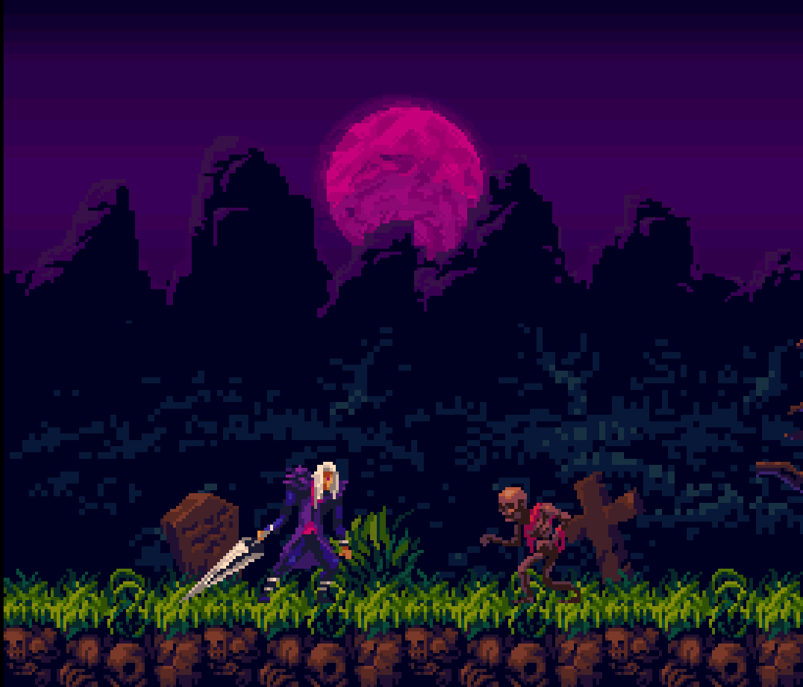
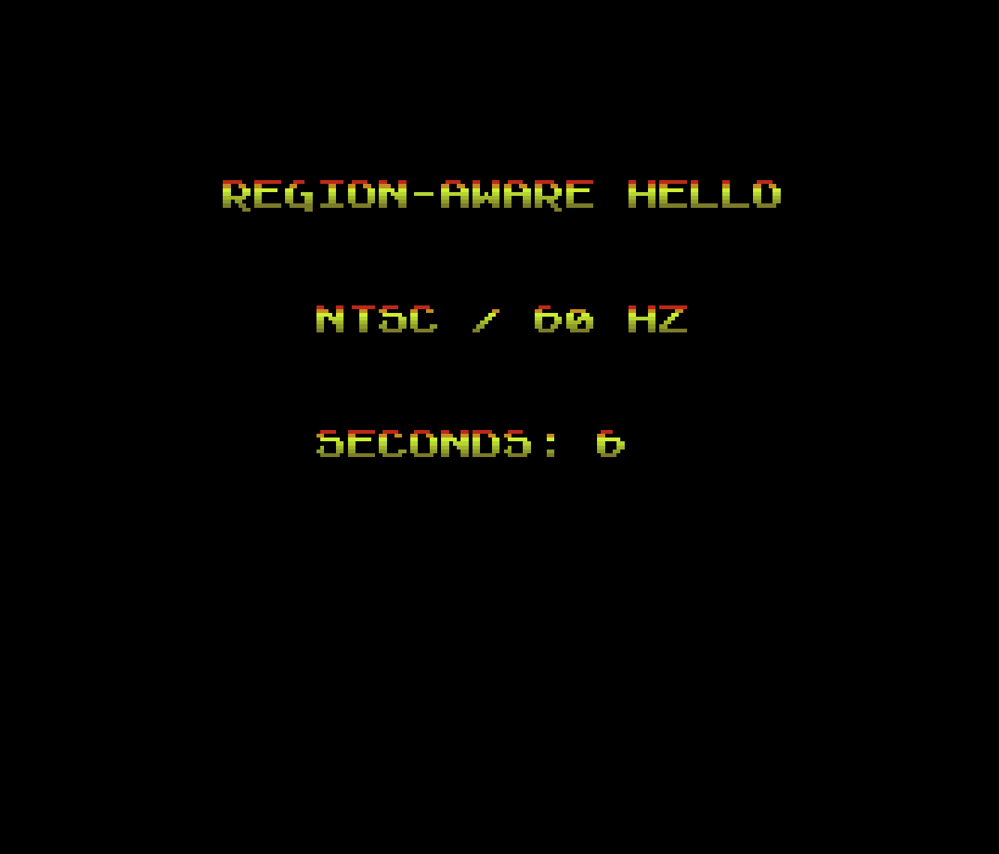

# snes-homebrew

Original SNES games written in **C with [PVSnesLib](https://github.com/alekmaul/pvsneslib)**, built
to strict hardware constraints: **LoROM, ≤512 KB, no enhancement chips, no SRAM, a single ROM that
runs on both NTSC (60 Hz) and PAL (50 Hz)** via runtime region detection, and works on real
hardware.

This repo holds two builds: a pipeline proof and a complete game demo.

---

## Gothicvania (`gothicvania/`)

A SNES action-platformer demo set in a haunted graveyard.



- **Flow:** title screen → play → "Game Over" (on death) or "Thanks for Playing" (on finish),
  driven by a `TITLE → PLAY → END / GAMEOVER` state machine.
- **World:** a 4800 px horizontally-scrolling level with 3-depth HDMA parallax, a per-scanline
  colour-math sky gradient, and a moon — rendered by a custom 64×32 page-streaming engine that
  keeps the whole level resident in under 16 KB of VRAM.
- **Hero:** run / jump / attack / hurt, gravity + per-tile collision (solid ground + one-way
  platforms), with NTSC/PAL-equal movement speeds.
- **Enemies:** three types sharing two streamed sprite slots — **skeleton** (rises from the ground,
  chases), **hell-gato** (paces back and forth), **ghost** (floats, bobs, turns to face you) — each
  with sword-kill + contact-knockback combat and a shared fiery death poof.
- **Hazards & life:** spike pits (−1 HP), a 3-HP limit → game over, fall-out respawn.
- **Audio:** original looping music (separate in-game and title tracks) + sound effects, via snesmod.
- **Compliant:** one 512 KB LoROM, runtime region detection, no special chips, no SRAM.

## hello-world-region (`hello-world-region/`)

A region-aware "hello world" that proves the full pipeline end to end
(C → 816-tcc → WLA-DX → ROM → Mesen2 → hardware) and demonstrates correct, identical behavior at
both 50 Hz and 60 Hz.



---

## Toolchain 

| Tool | Version | Installed at | Source |
|------|---------|--------------|--------|
| PVSnesLib | **4.5.0** (released 2025-12-28) | `~/pvsneslib` → `$PVSNESLIB_HOME` | [release `4.5.0`](https://github.com/alekmaul/pvsneslib/releases/tag/4.5.0) (`pvsneslib_450_64b_darwin.zip`) |
| Mesen2 | **2.1.1** (released 2025-07-06) | `/Applications/Mesen.app` | [release `2.1.1`](https://github.com/SourMesen/Mesen2/releases/tag/2.1.1) (`macOS_ARM64_AppleSilicon`) |

Host: **macOS 26.4.1, Apple Silicon (arm64)**. Both the PVSnesLib tool binaries and Mesen are native
arm64 — no Rosetta required.

---

## Environment

`$PVSNESLIB_HOME` is exported from `~/.zshrc`:

```sh
export PVSNESLIB_HOME="$HOME/pvsneslib"
```

That single variable is all the build needs — PVSnesLib's `devkitsnes/snes_rules` references every
tool (816-tcc, wla-65816, wlalink, gfx4snes, smconv, snesbrr) by absolute path under
`$PVSNESLIB_HOME`, so nothing extra goes on `PATH`. `make` (from Xcode Command Line Tools) is already
on `PATH`. Open a **new terminal** (or `source ~/.zshrc`) before building so the variable is set.

---

## macOS patch applied to the toolchain

PVSnesLib's shared build rules (`$PVSNESLIB_HOME/devkitsnes/snes_rules`) post-process the linker's
`.sym` file with GNU-style `sed -i '<script>'`. macOS ships **BSD sed**, which misparses that form
and fails the build at the final step (the ROM links fine, then `make` errors with
`sed: ... extra characters at the end of h command`).

Fixed by rewriting the two in-place edits to a portable `sed > tmp && mv` form (works with both BSD
and GNU sed):

- File patched: `$PVSNESLIB_HOME/devkitsnes/snes_rules` (the two `sed -i` lines, ~178 and ~184)
- Original preserved as: `$PVSNESLIB_HOME/devkitsnes/snes_rules.orig`

This file lives **outside the repo** (in the PVSnesLib install) and is shared by every PVSnesLib
project on this machine. **If you reinstall or upgrade PVSnesLib, re-apply this patch** or `make`
will fail on the `.sym` step again. Change each `sed -i` line from the in-place form to a temp-file
form:

```make
# before (GNU-only, breaks on macOS BSD sed):
	@sed -i '<script>' $(ROMNAME).sym
# after (portable):
	@sed '<script>' $(ROMNAME).sym > $(ROMNAME).sym.tmp && mv -f $(ROMNAME).sym.tmp $(ROMNAME).sym
```

The two affected scripts are `s/://` and `/ SECTIONSTART_/d;/ SECTIONEND_/d;/ RAM_USAGE_SLOT_/d;`.

---

## Build & run

From a project directory (`gothicvania/` or `hello-world-region/`):

```sh
make            # produces <ROMNAME>.sfc (+ .sym for the debugger)
make clean      # remove build artifacts
```

> **Note (`gothicvania/`):** the original CC0 source-art pack has been removed from the repo, so the
> `tools/adapt_*.py` / `build_*.py` converters are kept as readable references only — they no longer
> run. The committed `res/*.png` / `*.bin` are the source of truth and `make` builds the ROM from
> them directly (see the Makefile's "FROZEN ART" note).

Open a ROM in Mesen2 for debugging:

```sh
mesen gothicvania/gothicvania.sfc      # helper defined in ~/.zshrc
```

> **Why not `open -a Mesen file.sfc`?** Mesen.app declares no `.sfc` document type, so that launches
> Mesen *without* loading the ROM (black screen). The `mesen` helper passes the ROM as a CLI argument
> (`open -na Mesen --args <abs-path>`). You can also drag the `.sfc` onto the window, or **File →
> Open** (⌘O).

### Region testing

Every build must behave identically at 50 Hz and 60 Hz. In Mesen2, force the console region (NTSC,
then PAL) via the emulation settings and confirm timing matches, and use the **Event Viewer** to
confirm there are no VRAM writes outside VBlank.

---

## Hard constraints (do not violate)

LoROM only · ROM ≤ 512 KB · no special/enhancement chips · no SRAM (`CARTRIDGETYPE $00`,
`SRAMSIZE $00`) · single ROM with runtime NTSC/PAL detection · must run on real hardware · 100%
original assets & code.
